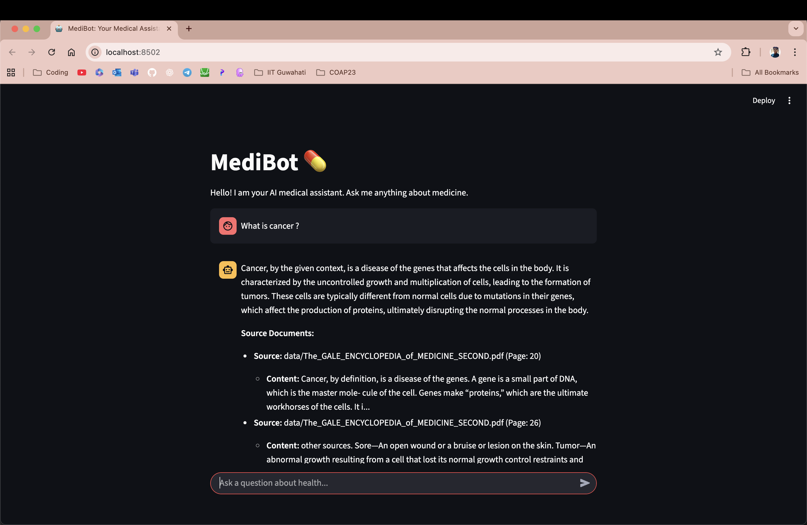
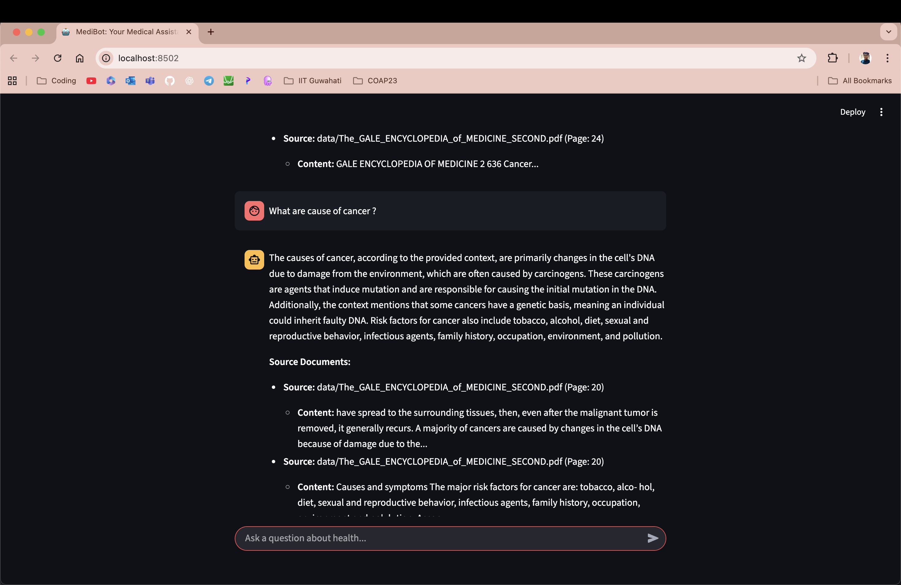
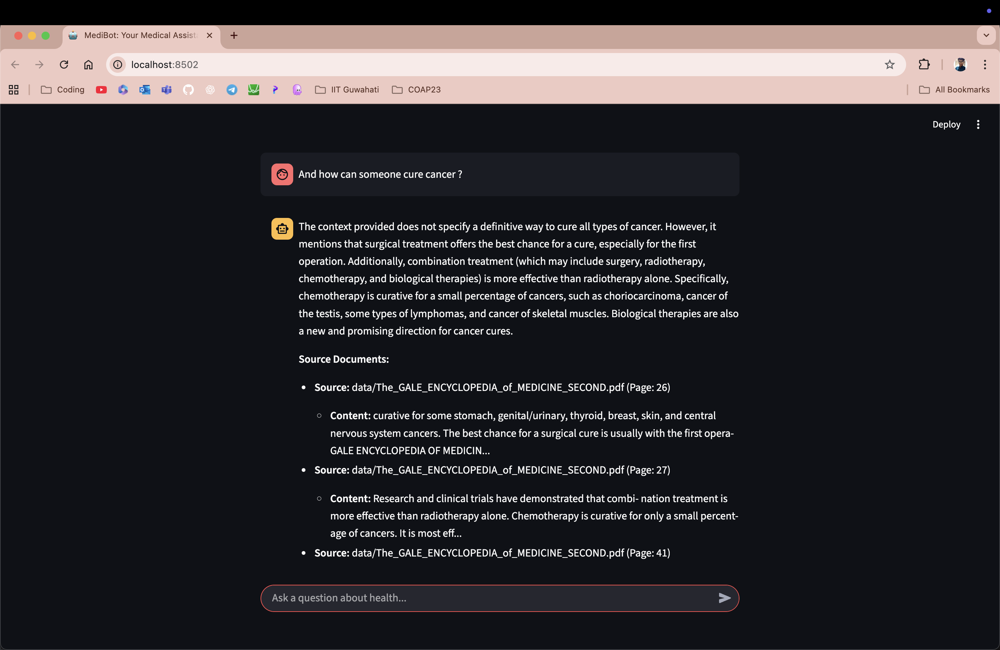

# 🤖 MediBot: Your AI Medical Assistant

This project implements a **Retrieval-Augmented Generation (RAG) chatbot** using **LangChain** and **Streamlit** to answer medical questions based on a knowledge base of PDF documents.  
The model leverages **Hugging Face** for the LLM and embeddings, and **FAISS** for vector storage.

---

## 🎯 Objective
To create a chatbot that provides **accurate, context-aware answers** to medical queries by retrieving information from a private knowledge base.

---

## ✅ Features
- 📦 Ingests **PDF documents** to build a custom knowledge base.  
- 🧠 Creates a **FAISS vector database** for efficient semantic search.  
- 📝 Splits documents into chunks using **RecursiveCharacterTextSplitter**.  
- 🗣️ Utilizes a **Hugging Face LLM (Mistral-7B-Instruct-v0.3)** for generating answers.  
- 🎨 Provides a **user-friendly chat interface** with Streamlit.  
- 🔒 Manages **API keys securely** using Streamlit's secrets management.  

---

## 🛠️ Tech Stack
- **Python 3.x**  
- **Streamlit**  
- **LangChain**  
- **HuggingFace LLM**  
- **FAISS-CPU**  
- **python-dotenv**  
- **PyPDF**  
- **Sentence-transformers**  

---

## 🗂️ Knowledge Base
- **Data Directory**  
  - Location: `data/`  
  - Content: PDF files (`.pdf`) containing medical information.  

---

## 🧠 Model Architecture (RAG)
```plaintext
User Query → FAISS Search (Vector Store) → Relevant Document Chunks → Custom Prompt (LangChain) + LLM → Generated Answer
```
## 🚀 How to Run

### Step 1: Clone the Repository & Install Dependencies
```bash
git clone <[repository-url](https://github.com/Gorachand2501/Medibot-Medical_Chat_Bot)>
cd medibot
pip install -r requirements.txt
```

### Step 2: Set Up Environment Variables
Create a file named `.streamlit/secrets.toml` to store your Hugging Face API token.

```toml
# .streamlit/secrets.toml
HF_TOKEN = "your_huggingface_api_token_here"

# Optional: Specify a different LLM model
HUGGINGFACE_REPO_ID = "mistralai/Mistral-7B-Instruct-v0.3"
```
### Step 3: Ingest Documents
Run the `ingest.py` script to process your PDF files and create the vector database.

```bash
python ingest.py
```
### Step 4: Launch the App
Start the Streamlit application.

```bash
streamlit run app.py
```

## 📂 Project Structure

```plaintext
├── app.py             # Streamlit front-end for the chatbot
├── ingest.py          # Script for document loading and vector store creation
├── utils.py           # Utility functions for LLM, prompts, and QA chain
├── requirements.txt   # Python dependencies
├── data/              # Directory to store your PDF files
├── vectorstore/       # Directory for the FAISS database (generated after ingestion)
└── .streamlit/        # Directory for secrets management
    └── secrets.toml
```






## ⚠️ Disclaimer

This project is for **educational purposes only**.  
MediBot is **not a substitute for professional medical advice**.  
Always consult a **qualified healthcare provider** for medical concerns.

